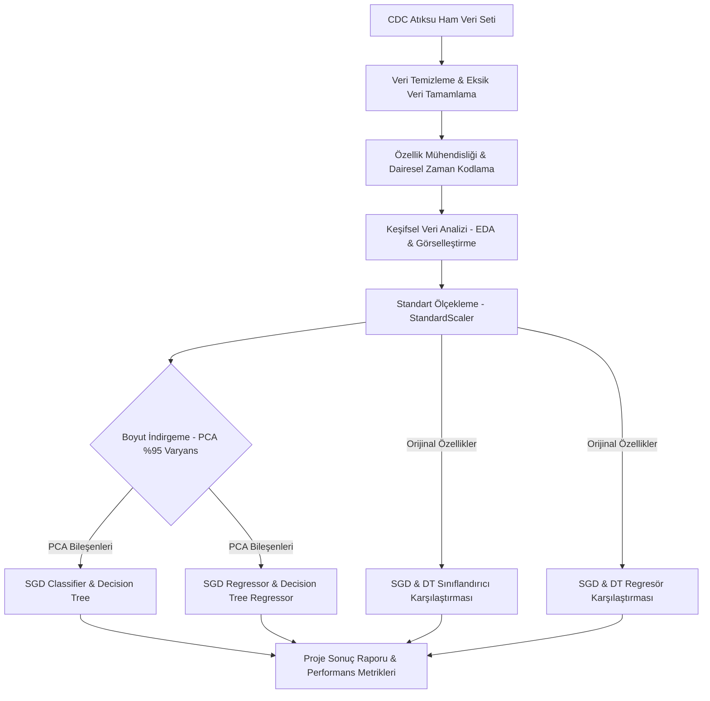

<div align="center">

  # 📊 CDC Atıksu Influenza A Veri Madenciliği ve Makine Öğrenmesi Projesi

  **Atıksu Epidemiyolojisi Verileri Üzerinden Grip (Influenza A) Varlığı ve Viral RNA Konsantrasyonu Tahmini**

  [](https://www.python.org/)
  [](https://jupyter.org/)
  [](https://scikit-learn.org/)
  [](https://pandas.pydata.org/)
  [](LICENSE)

  [Proje Hakkında](#-proje-hakkında) •
  [Veri Madenciliği Akışı](#-veri-madenciliği-ve-model-akışı) •
  [Özellik Mühendisliği](#-özellik-mühendisliği--ön-işleme) •
  [Model Performansı](#-model-sonuçları-ve-karşılaştırma) •
  [Kurulum ve Kullanım](#-kurulum-ve-kullanım)

</div>

---

## 👥 Grup Projesi Hakkında

Bu proje, **Veri Madenciliği (Data Mining)** dersi kapsamında geliştirilmiş kapsamlı bir **Grup Projesidir**. 

Projenin temel amacı; Amerika Birleşik Devletleri Hastalık Kontrol ve Önleme Merkezleri (**CDC**) tarafından sağlanan gerçek dünya atıksu izleme verilerini (`CDC_Wastewater_Data_for_Influenza_A`) kullanarak halk sağlığını doğrudan ilgilendiren epidemiyolojik tahmin modelleri geliştirmektir.

Atıksulardaki viral RNA konsantrasyonları, klinik teşhislerden günler önce toplumdaki salgın eğilimlerini yansıtmaktadır. Bu çalışmada hem **Sınıflandırma (Classification)** hem de **Regresyon (Regression)** teknikleri uygulanarak karşılaştırmalı analizler yapılmıştır.

---

## 💡 Amaç ve Problemin Tanımı

 projesi kapsamında iki temel makine öğrenmesi görevi çözülmüştür:

1. **Sınıflandırma Problemi (`influenza_a_detected`)**: Atıksu örneğinde Influenza A virüsünün tespit edilip edilemeyeceğinin ikili (binary: 0 / 1) tahmini.
2. **Regresyon Problemi (`log_pcr_target_conc`)**: Atıksudaki logaritmik PCR viral RNA hedef konsantrasyonunun sürekli (continuous) sayısal tahmini.

---

## 🔄 Veri Madenciliği ve Model Akışı



---

## 🛠️ Özellik Mühendisliği & Ön İşleme

Ham veri setindeki gürültüleri temizlemek ve model başarımını artırmak için aşağıdaki teknikler uygulanmıştır:

* 🕒 **Dairesel Zaman Kodlaması (Cyclical Time Encoding)**: Zamanın mevsimsel etkisini modele kazandırmak için toplama ayı ve haftanın günü `sin` ve `cos` dönüşümlerine tabi tutulmuştur (`month_sin`, `month_cos`, `dayofweek_sin`, `dayofweek_cos`).
* 📈 **Logaritmik Dönüşüm**: Hizmet verilen nüfus (`log_population_served`), debi (`log_flow_rate`) ve viral yük değerlerindeki çarpıklığı düzeltmek için `log1p` uygulanmıştır.
* 👥 **Kişi Başına Viral Yük Etkileşimi**: `log_conc_per_capita` yeni özelliği türetilmiştir.
* 🏷️ **Kategorik Gruplama & Kodlama**: Hizmet verilen nüfus büyüklüğüne göre kategorik gruplama (`Small`, `Medium`, `Large`, `Very Large`) ve frekans kodlaması (`jurisdiction_freq`) yapılmıştır.
* 📉 **PCA (Ana Bileşen Analizi)**: Varyansın %95'ini koruyacak şekilde çoklu doğrusal bağlantı gösteren özellikler boyut indirgemeye tabi tutulmuştur.

---

## 📊 Model Sonuçları ve Karşılaştırma

Model eğitimlerinde **Lineer (SGD)** ve **Ağaç Tabanlı (Decision Tree)** modeller hem **PCA uygulanmış** hem de **Orijinal Özellikler** ile eğitilerek performansları kıyaslanmıştır.

### 1. Sınıflandırma Modelleri Karşılaştırması (`influenza_a_detected`)

| Model | Yapı | Veri Tipi | Accuracy (Doğruluk) |
| :--- | :--- | :--- | :---: |
| 🥇 **SGD Classifier (Model 1.1)** | Lineer | PCA Uygulanmış | **%75.11** |
| 🥈 **Decision Tree (Model 1.2)** | Non-Lineer (Ağaç) | PCA Uygulanmış | **%74.92** |
| 🥉 **SGD Classifier (Model 1.4)** | Lineer | Orijinal Özellikler | **%74.72** |
| 🏅 **Decision Tree (Model 1.3)** | Non-Lineer (Ağaç) | Orijinal Özellikler | **%73.41** |

> 💡 *Bulgu:* Sınıflandırma görevinde PCA uygulanmış verilerle eğitilen **SGD Classifier (Lineer)** %75.11 doğruluk ile en yüksek başarıyı elde etmiştir.

---

### 2. Regresyon Modelleri Karşılaştırması (`log_pcr_target_conc`)

| Model | Yapı | Veri Tipi | R-Kare ($R^2$) Skoru |
| :--- | :--- | :--- | :---: |
| 🥇 **Decision Tree Regressor (Model 2.2)** | Non-Lineer (Ağaç) | PCA Uygulanmış | **0.3656** |
| 🥈 **SGD Regressor (Model 2.4)** | Lineer | Orijinal Özellikler | **0.3291** |
| 🥉 **SGD Regressor (Model 2.1)** | Lineer | PCA Uygulanmış | **0.3285** |
| 🏅 **Decision Tree Regressor (Model 2.3)** | Non-Lineer (Ağaç) | Orijinal Özellikler | **0.0445** |

> 💡 *Bulgu:* Sürekli viral konsantrasyon tahmininde PCA uygulanmış **Decision Tree Regressor** $R^2 = 0.3656$ skoru ile en iyi performansı sergilemiştir.

---

## 📁 Proje Dizin Yapısı

```
Veri-Madenciligi-Proje/
├── veri.ipynb                      # Ana Jupyter Notebook (EDA, Ön işleme, PCA ve Makine Öğrenmesi Kodları)
├── veri seti son hali.zip           # Ön işlenmiş ve modellemeye hazır temiz veri seti
├── veri seti.zip                    # Ham CDC Influenza A atıksu veri arşivi
├── LICENSE                         # MIT Lisans Belgesi
└── README.md                       # Proje Dokümantasyonu
```

---

## 🚀 Kurulum ve Kullanım

### Gereksinimler
- Python 3.8+
- Jupyter Notebook / JupyterLab

### Bağımlılıkların Yüklenmesi
Gerekli Python kütüphanelerini yüklemek için terminalde aşağıdaki komutu çalıştırın:

```bash
pip install pandas numpy matplotlib seaborn scikit-learn jupyter
```

### Projeyi Çalıştırma

1. Repoyu klonlayın:
   ```bash
   git clone https://github.com/iamhilals/Veri-Madenciligi-Proje.git
   cd Veri-Madenciligi-Proje
   ```

2. Jupyter Notebook'u başlatın:
   ```bash
   jupyter notebook veri.ipynb
   ```

3. `veri.ipynb` içerisindeki hücreleri sırasıyla çalıştırarak analiz sonuçlarını ve grafiklerini inceleyebilirsiniz.

---

## 📜 Lisans

Bu proje **MIT Lisansı** altında açık kaynaklı olarak paylaşılmıştır. Detaylar için [`LICENSE`](LICENSE) dosyasına bakabilirsiniz.

<div align="center">
  <sub>Veri Madenciliği Grup Projesi • CDC Wastewater Data Analysis</sub>
</div>